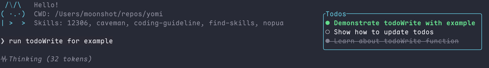

# Yomi

[](https://www.rust-lang.org)
[](LICENSE)

A powerful AI coding assistant CLI built in Rust, featuring an async agent loop, sub-agent support, and an elegant TUI interface.



## Features

### Intelligent Agent System
- **Async Agent Loop** - Event-driven architecture for efficient task processing
- **State Machine** - Robust state management with proper transitions (Idle → Streaming → ExecutingTool → WaitingForInput)
- **Cancel Token** - Graceful cancellation support for long-running tasks with cascading cancellation to sub-agents
- **Context Management** - Rich execution context with message history and tool registry

### Sub-Agent Support
- **Parallel Execution** - Spawn multiple sub-agents to work concurrently
- **Sync & Async Modes** - Choose between waiting for results or fire-and-forget
- **Context Inheritance** - Sub-agents can inherit parent conversation history
- **Permission Propagation** - Sub-agent permission requests bubble up to the main TUI

### Beautiful TUI
- **Interactive Interface** - Built with `tuirealm` for smooth navigation
- **Real-time Updates** - Watch task progress live with token usage tracking
- **Markdown Rendering** - Beautiful display of AI responses with table support
- **Permission Dialogs** - Interactive confirmation for potentially dangerous operations
- **Command Palette** - Quick access to common actions

### Built-in Tools
| Tool | Description | Safety Level |
|------|-------------|--------------|
| `Read` | Read file contents with line numbers | Safe |
| `Write` | Write files (requires read-first) | Caution |
| `Edit` | Surgical text edits with diff preview | Caution |
| `Bash` | Execute shell commands | Dangerous |
| `Glob` | Find files by pattern (respects .gitignore) | Safe |
| `Grep` | Search file contents with ripgrep | Safe |
| `Subagent` | Spawn sub-agents for parallel work | Caution |

### Permission System
- **Three Safety Levels** - Safe (read-only), Caution (modifications), Dangerous (destructive)
- **Per-Tool Memory** - "Remember this choice" per tool type
- **Auto-approve Threshold** - Configure what level requires confirmation
- **YOLO Mode** - Optional flag to skip all confirmations (`--yolo`)

### Multi-Provider Support
- **OpenAI** - GPT-4, GPT-4o, GPT-3.5-turbo
- **Anthropic** - Claude 3.5 Sonnet, Claude 3 Opus, Claude 3 Haiku
- **Extensible** - Easy to add new providers via trait-based abstraction

### Persistent Storage
- **SQLite Backend** - Reliable task and session persistence
- **Session Management** - Resume previous sessions anytime
- **Message History** - Full conversation context with compaction support

## Quick Start

### Prerequisites

- Rust 1.75+ (install via [rustup](https://rustup.rs))
- API key from OpenAI or Anthropic

### Installation

```bash
# Clone the repository
git clone https://github.com/yourusername/yomi.git
cd yomi

# Build release binary
cargo build --release

# Install to cargo bin directory
cargo install --path crates/cli
```

### Configuration

```bash
# OpenAI
export OPENAI_API_KEY=sk-...
export OPENAI_API_MODEL=gpt-4o  # optional, defaults to gpt-4o

# Anthropic
export ANTHROPIC_API_KEY=sk-ant-...
export ANTHROPIC_API_MODEL=claude-3-5-sonnet-20241022
```

### Usage

#### Interactive TUI Mode

```bash
# Launch TUI in current directory
yomi

# Specify working directory
yomi -d ./my-project

# Resume last session for this directory
yomi -r

# Start with specific prompt
yomi -p "Review the codebase for security issues"
```

#### YOLO Mode

Skip all confirmations (use with caution):

```bash
yomi --yolo
```

#### CLI Mode

Execute a single command and exit:

```bash
yomi --cli "Find all TODO comments in the codebase"
```

## Architecture

```
yomi/
├── crates/
│   ├── kernel/         # Core agent system
│   │   ├── agent/      # Agent implementation with state machine
│   │   ├── permissions/# Permission checker and level management
│   │   ├── task/       # Task management with SQLite storage
│   │   ├── providers/  # LLM provider abstractions (OpenAI, Anthropic)
│   │   ├── tools/      # Built-in tools (Read, Edit, Bash, Glob, Grep, Subagent)
│   │   └── skill/      # Skill/ability system for extending capabilities
│   ├── cli/            # Command-line interface
│   └── tui/            # Terminal UI with tuirealm
├── skills/             # Built-in skills (markdown files)
└── docs/               # Documentation
```

### Core Concepts

1. **Agent** - The main execution unit with event-driven message processing
2. **SimpleAgent** - Lightweight agent for sub-agents without persistence overhead
3. **PermissionState** - Shared permission configuration across all agents in a session
4. **ToolRegistry** - Dynamic tool registration and execution
5. **Provider** - Trait-based abstraction over different LLM APIs with streaming support

## Development

### Running Tests

```bash
# Run all tests
cargo test --workspace

# Run specific crate tests
cargo test -p kernel
cargo test -p tui
```

### Project Structure

- `crates/kernel/src/agent/` - Agent loop, state machine, cancel token
- `crates/kernel/src/permissions/` - Permission checker with level-based approval
- `crates/kernel/src/tools/` - Tool implementations (file ops, bash, search, subagent)
- `crates/tui/src/components/` - TUI components (chat view, input, dialogs)

## Safety

- **Read-Only by Default** - Tools are categorized by safety level
- **Git-Aware** - Respects .gitignore in Glob/Grep operations
- **File State Tracking** - Write/Edit tools require reading files first to prevent conflicts
- **Cancellation Support** - All long-running operations can be cancelled

## License

This project is licensed under the MIT License - see the [LICENSE](LICENSE) file for details.

## Acknowledgments

- Built with [Tokio](https://tokio.rs) async runtime
- TUI powered by [tuirealm](https://github.com/veeso/tuirealm)
- File operations use [ignore](https://crates.io/crates/ignore) crate for git-aware walking
- Inspired by [Claude Code](https://claude.ai/code) and similar AI coding assistants
