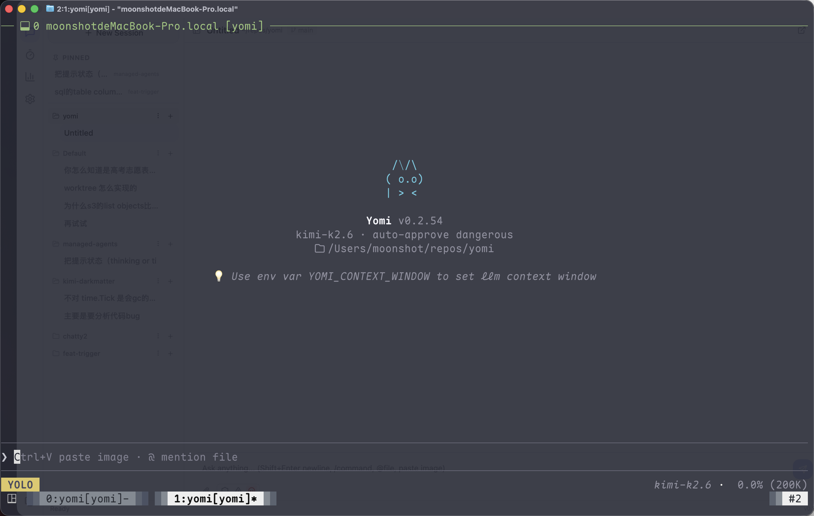

# Yomi

[](https://www.rust-lang.org)
[](https://github.com/crescent617/yomi/actions)
[](LICENSE)

> A minimalist AI coding assistant built in Rust, with both terminal and desktop interfaces.

| TUI | GUI |
|-----|-----|
|  |  |

## Features

- **TUI** — minimalist terminal interface for seamless interaction
- **GUI** — desktop app built with Tauri for a richer experience
- **Tools** — built-in file operations (read/write/edit), glob/grep, shell command execution, and more
- **Configurable** — context window, agent tools, and LLM provider settings
- **Safe by default** — all operations require user confirmation except in YOLO mode

## Quick Start

### Prerequisites

- Rust 1.90+ (install via [rustup](https://rustup.rs))
- API key from OpenAI or Anthropic

### Dependencies

- [ripgrep](https://github.com/BurntSushi/ripgrep) (`rg`) — for file search
- [Nerd Font](https://www.nerdfonts.com/) — for UI icons (optional but recommended)

### Installation

#### CLI / TUI

```bash
brew update && brew install crescent617/tap/yomi
```

#### GUI

```bash
brew update && brew install crescent617/tap/yomi-gui
```

Or download the latest `.dmg` from the [releases page](https://github.com/crescent617/yomi/releases).

### Configuration

See [config.md](docs/config.md) for more options.

```bash
# General
export YOMI_CONTEXT_WINDOW=200k

# OpenAI
export OPENAI_API_KEY=sk-...
export OPENAI_API_MODEL=gpt-4o  # optional, defaults to gpt-4o
export OPENAI_API_BASE=https://xxx

# Anthropic
export YOMI_PROVIDER=anthropic
export ANTHROPIC_AUTH_TOKEN=sk-...
export ANTHROPIC_BASE_URL=https://xxx
export ANTHROPIC_MODEL=xxx
```

### Usage

#### GUI Mode

```bash
yomi-gui
```

#### Interactive TUI Mode

```bash
# Launch TUI in current directory
yomi

# help
yomi -h
```

#### YOLO Mode

Skip all confirmations (use with caution):

```bash
yomi --yolo
yomi -y
```

## Safety

- **Read-Only by Default** - Tools are categorized by safety level
- **Git-Aware** - Respects .gitignore in Glob/Grep operations
- **File State Tracking** - Write/Edit tools require reading files first to prevent conflicts
- **Cancellation Support** - All long-running operations can be cancelled

## License

This project is licensed under the MIT License - see the [LICENSE](LICENSE) file for details.

## Acknowledgments

- Built with [Tokio](https://tokio.rs) async runtime
- TUI powered by [tuirealm](https://github.com/veeso/tuirealm)
- GUI powered by [Tauri](https://tauri.app)
- File operations use [ignore](https://crates.io/crates/ignore) crate for git-aware walking
- Inspired by [Claude Code](https://claude.ai/code) and similar AI coding assistants
