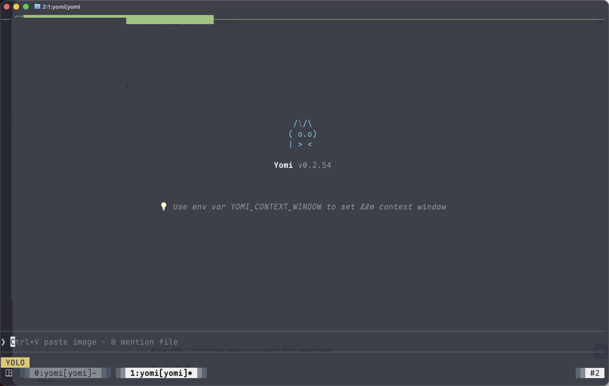

# Yomi

[](https://www.rust-lang.org)
[](https://github.com/crescent617/yomi/actions)
[](LICENSE)

> A minimalist AI coding assistant built in Rust, with both terminal and desktop interfaces.

| TUI | GUI |
|-----|-----|
|  |  |

## Design Philosophy

> **The stream is reality. The filesystem is the registry.**

1. **Everything is stream** — in as messages, out as events, borne by sessions; nothing lives off-stream.
2. **State is cache** — discarded at will, restored at a fold.
3. **Model is suspect** — bounded by design, not by hope.
4. **Spawn, don't link** — extensions are executables driven over stdio (JSON in, exit code and stdout out); no sockets, no SDK, no reload — any language that can read stdin can extend yomi.
5. **One engine, one shape** — gate hooks, custom tools, and daemon-lifecycle hooks are the same pipeline; they differ only in trigger and exit-code semantics.
6. **Deletion is design** — an abstraction that duplicates an existing one doesn't get to exist.

## Features

- **TUI** — minimalist terminal interface for seamless interaction
- **GUI** — desktop app built with Tauri for a richer experience
- **Channels** — Feishu/Telegram integration in daemon mode: every chat gets its own persistent agent session (see [Channels](#channels-im-integration))
- **Extensions** — drop executables into `hooks/` or `tools/` directories: gate tool calls, add custom tools, or hook daemon lifecycle (see [`docs/EXTENSIONS.md`](docs/EXTENSIONS.md))
- **Tools** — built-in file operations (read/write/edit), glob/grep, shell command execution, and more
- **Configurable** — context window, agent tools, and LLM provider settings
- **Safe by default** — all operations require user confirmation except in YOLO mode

## Quick Start

### Prerequisites

- Rust 1.90+ (install via [rustup](https://rustup.rs))
- API key from OpenAI or Anthropic

### Dependencies

- [ripgrep](https://github.com/BurntSushi/ripgrep) (`rg`) — for file search
- [Nerd Font](https://www.nerdfonts.com/) — for UI icons (optional but recommended)

### Installation

#### Both (CLI + GUI)

```bash
brew update && brew install crescent617/tap/yomi-app crescent617/tap/yomi
```

#### CLI / TUI only

```bash
brew update && brew install crescent617/tap/yomi
```

#### GUI only

```bash
brew update && brew install crescent617/tap/yomi-app
```

Or download the latest `.dmg` from the [releases page](https://github.com/crescent617/yomi/releases).

### Configuration

See [CONFIG.md](docs/CONFIG.md) for more options.

```bash
# General
export YOMI_CONTEXT_WINDOW=200k

# OpenAI
export OPENAI_API_KEY=sk-...
export OPENAI_API_MODEL=gpt-4o  # optional, defaults to gpt-4o
export OPENAI_API_BASE=https://xxx

# Anthropic
export YOMI_PROVIDER=anthropic
export ANTHROPIC_AUTH_TOKEN=sk-...
export ANTHROPIC_BASE_URL=https://xxx
export ANTHROPIC_MODEL=xxx
```

### Web Search

The `web_search` tool tries engines in the following priority order. Set the environment variable for the engine(s) you want to enable.

| Priority | Engine | Environment Variable | Notes |
| --- | --- | --- | --- |
| 1 | SearXNG | `SEARXNG_URL` | Self-hosted; recommended. See [SearXNG with Docker](#searxng-with-docker) below. |
| 2 | Kimi | `KIMI_AGENT_API_KEY` | Optional `KIMI_SEARCH_ENDPOINT` to override the built-in endpoint. |
| 3 | Serper | `SERPER_API_KEY` | Paid Google Search API. |
| 4 | Brave | `BRAVE_API_KEY` | Paid Brave Search API. |
| 5 | DuckDuckGo | — | Free HTML scraping fallback. |
| 6 | Bing | — | Free HTML scraping fallback. |

The GUI loads environment variables from `~/.env` at startup (`%USERPROFILE%\.env` on Windows). Example:

```dotenv
SEARXNG_URL=http://127.0.0.1:8080
KIMI_AGENT_API_KEY=sk-...
```

Restart the GUI after editing this file.

#### SearXNG with Docker

SearXNG is the recommended self-hosted option. This minimal Compose setup binds the service to localhost only.

Create `compose.yaml`:

```yaml
services:
  searxng:
    image: docker.io/searxng/searxng:latest
    container_name: searxng
    ports:
      - "127.0.0.1:8080:8080"
    volumes:
      - ./searxng:/etc/searxng:rw
    restart: unless-stopped
```

Start it once to create the configuration directory:

```bash
docker compose up -d
```

Yomi requests SearXNG results with `format=json`. SearXNG commonly enables only HTML by default, so add `json` to `searxng/settings.yml` while preserving the other settings:

```yaml
search:
  formats:
    - html
    - json
```

Restart SearXNG after changing the file:

```bash
docker compose restart searxng
```

Verify that JSON search is enabled:

```bash
curl --fail --get 'http://127.0.0.1:8080/search' \
  --data-urlencode 'q=yomi' \
  --data-urlencode 'format=json'
```

The response should be JSON containing a `results` array. A `403 Forbidden` response usually means `json` is missing from `search.formats`.

For detailed configuration guidance, see [`docs/CONFIG.md`](docs/CONFIG.md) and the [official SearXNG container documentation](https://docs.searxng.org/admin/installation-docker.html).

### Usage

#### GUI Mode

```bash
yomi-gui
```

#### Interactive TUI Mode

```bash
# Launch TUI in current directory
yomi

# help
yomi -h
```

#### YOLO Mode

Skip all confirmations (use with caution):

```bash
yomi --yolo
yomi -y
```

## Channels (IM integration)

Run Yomi as a long-lived daemon to serve IM chats. Every chat (or thread) gets its own persistent agent session by default — a 1:1 mapping, so context stays scoped per conversation — and replies are delivered back to the same conversation.

| Platform | Support |
| --- | --- |
| Feishu | Full: live status cards for run progress, interactive cards (`/settings`, `/cron`, mailbox), reply-in-thread, @-mention gating, run-completion subscriptions, doc-comment triggers |
| Telegram | Basic: text-only chat (markdown, quote replies; no cards) |

Frequently used in-chat commands (run `/help` in a chat for the full list):

- `/model` — show or switch the session's model
- `/stop` — cancel the current run
- `/settings` — interactive panel: mention / reply-in-thread / model overrides (admin)
- `/cron` — interactive panel: pause / resume / delete scheduled jobs (admin)
- `/subscribe` — get notified when runs complete
- `/clear` — clear the session's context

```bash
yomi daemon start    # serve the configured channels
```

See [`docs/CONFIG.md`](docs/CONFIG.md) for `[[channels]]` setup (platform credentials, mention / reply-in-thread defaults, per-channel models).

## Safety

- **Read-Only by Default** - Tools are categorized by safety level
- **Git-Aware** - Respects .gitignore in Glob/Grep operations
- **File State Tracking** - Write/Edit tools require reading files first to prevent conflicts
- **Cancellation Support** - All long-running operations can be cancelled

## License

Copyright (C) 2026 [Huaru Li](mailto:crescent617@outlook.com). See [NOTICE](NOTICE) for the copyright notice.

This project is licensed under the GNU Affero General Public License v3.0 only (`AGPL-3.0-only`) - see the [LICENSE](LICENSE) file for details.

You may use this project commercially, but distributing modified versions or making modified versions available to users over a network requires offering the corresponding source code under the same license.

## Acknowledgments

- Built with [Tokio](https://tokio.rs) async runtime
- TUI powered by [tuirealm](https://github.com/veeso/tuirealm)
- GUI powered by [Tauri](https://tauri.app)
- File operations use [ignore](https://crates.io/crates/ignore) crate for git-aware walking
- Inspired by [Claude Code](https://claude.ai/code) and similar AI coding assistants
