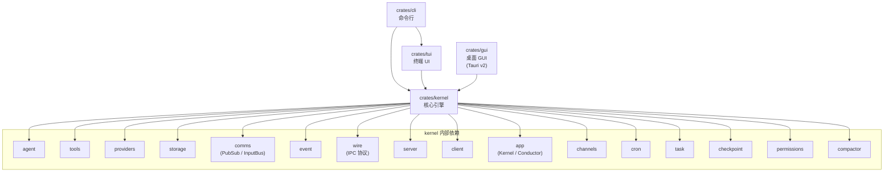
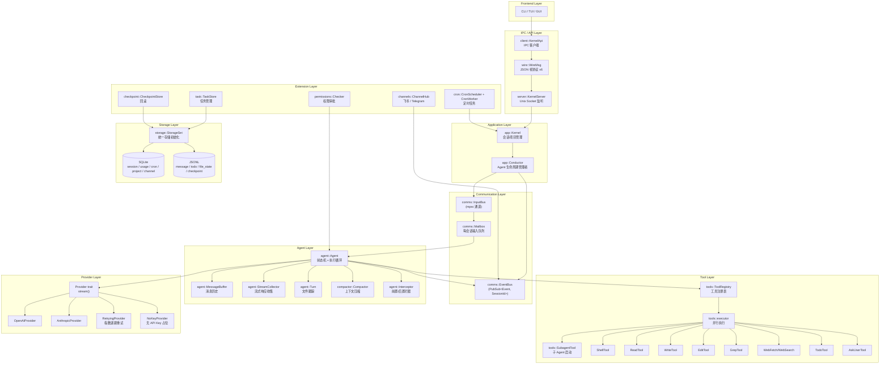
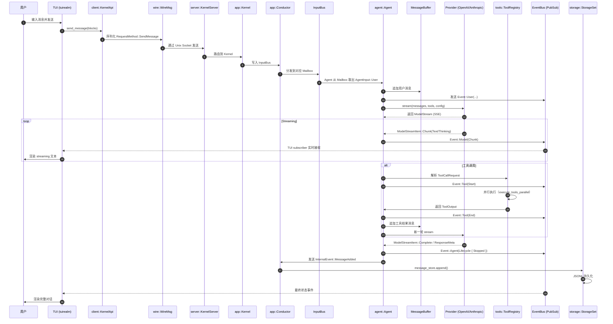

# Yomi 架构文档

> 基于仓库实际文件内容生成。版本：workspace `0.3.0`。

---

## 概述

**Yomi** 是一个 AI 编程助手（AI coding assistant），采用多 crate 工作空间结构，支持终端 TUI、桌面 GUI 和命令行 CLI 三种前端界面。核心架构为**基于事件总线的异步 Actor 模型**：

- 所有业务逻辑集中在 `kernel` crate 中，提供统一的会话管理、Agent 执行、工具调用、模型 Provider、持久化存储和跨进程通信（IPC）能力。
- 前端（TUI/GUI/CLI）通过 `KernelApi` 与 kernel 交互，支持**本地内联**（in-process）和**远程 IPC**（通过 Unix socket）两种模式。
- 内核以 **daemon** 形式常驻运行，前端可以连接、断开、重连，会话状态由内核维护。
- 事件驱动：`kernel` 内部使用 `PubSub` 泛型发布-订阅总线进行模块间通信，事件对外部 subscriber 支持自定义 filter（如过滤 `InternalEvent`）。

---

## Crate 结构

### `crates/kernel` — 核心引擎

| 模块 | 文件路径 | 职责 |
|------|---------|------|
| `agent` | `src/agent/` | Agent 生命周期、状态机（`AgentState`）、消息缓冲（`MessageBuffer`）、流收集（`StreamCollector`）、Turn 跟踪、compaction、拦截器、取消逻辑 |
| `tools` | `src/tools/` | 20+ 工具实现：`shell`、`read`、`write`、`edit`、`grep`、`glob`、`websearch`、`subagent`、`todo`、`reminder`、`sleep` 等（`ask_user` 已下线不注册，实现保留于 `ask_user.rs`；`web_fetch` 已移除，网页抓取走 shell curl，见 `docs/design/webfetch-removal.md`）；含 `ToolRegistry` 注册管理 |
| `providers` | `src/providers/` | LLM Provider 抽象：`OpenAIProvider`、`AnthropicProvider`；支持 SSE streaming、thinking、fallback、重试（`RetryingProvider`） |
| `storage` | `src/storage/` | 统一存储层：`StorageSet` 初始化所有后端；SQLite（session/usage/cron/project/channel）+ JSONL（message/todo/file_state/checkpoint） |
| `comms` | `src/comms/` | `PubSub` 事件总线（支持按 key 过滤订阅）、`InputBus`/`Mailbox` 输入通道、`EventSink` 事件接收器 |
| `event` | `src/event.rs` | 核心事件枚举：`Event`（`User`/`Agent`/`Model`/`Tool`/`System`/`Internal`）及 `ControlCommand` |
| `wire` | `src/wire.rs` | IPC 序列化协议（JSON），定义 `RequestMethod`/`ResponseBody`/`WireMsg`，当前协议版本 `WIRE_PROTOCOL_VERSION = 6` |
| `server` | `src/server/mod.rs` | Daemon 服务端：`KernelServer` 通过 Unix socket 监听客户端连接，管理 cron 调度器和 channel 生命周期 |
| `client` | `src/client/mod.rs` | 客户端：`KernelApi` trait + 基于 socket 的 IPC 实现，含心跳、重连、RPC 超时（30s） |
| `app` | `src/app/` | `Kernel`（会话/项目管理的对外 API）和 `Conductor`（Agent 生命周期唯一管理者） |
| `channels` | `src/channels/` | 外部渠道接入：飞书（Feishu）、Telegram；支持消息收发与会话映射 |
| `cron` | `src/cron/` | 定时任务系统：`CronScheduler` + `CronWorker`，支持 cron 表达式调度任务 |
| `task` | `src/task/` | 任务管理子系统：创建、更新、查询、列表工具 |
| `checkpoint` | `src/checkpoint/` | 会话检查点与回滚（`RewindTarget`：对话、文件、或两者） |
| `permissions` | `src/permissions/` | 工具权限分级（safe / caution / dangerous / ask）及 `Checker` 审批逻辑 |
| `compactor` | `src/compactor/` | 上下文压缩：当消息量接近上下文窗口阈值时自动 summary 压缩 |
| `config` | `src/config.rs` | TOML 配置 + 环境变量覆盖（前缀 `YOMI_`），支持 `ModelProvider::OpenAI` / `Anthropic` |
| `prompt` | `src/prompt.rs` | 系统提示构建（`SystemPromptBuilder`） |
| `skill` | `src/skill/` | 技能：`SkillScanner` 扫描磁盘 YAML 定义；`SkillLoader` 热加载（TTL 缓存 + 并发单飞 + 分层合并） |
| `transport` | `src/transport/` | IPC 底层传输：帧协议（长度前缀 + JSON） |
| `types` | `src/types.rs` | 核心类型：`SessionId`、`MessageId`、`Message`、`ContentBlock`、`ToolDefinition`、`ToolOutput`、ID 生成宏（`define_id!`） |
| `utils` | `src/utils/` | 搜索（Bing/Brave/DDG/SearXNG）、HTML 转文本、图片处理、路径工具、token 计数等 |

### `crates/cli` — 命令行界面

- 入口：`src/main.rs`（`bin: yomi`）
- 使用 `clap` 定义子命令：`tui`（默认）、`session`、`skill`、`config`、`usage`、`version`、`daemon`
- 默认行为：启动 TUI（`tui::run`）
- 提供 `GlobalArgs` 供各命令共享参数

### `crates/gui` — 桌面 GUI（Tauri v2）

- 入口：`src/main.rs`
- 使用 **Tauri v2** 框架，前端为 Web 技术栈
- 插件：`tauri-plugin-dialog`、`fs`、`opener`、`store`、`notification`、`pilot`（debug 构建）
- 命令（`#[tauri::command(rename_all = "snake_case")]`）：项目/会话/聊天/自动化/检查点/技能/系统管理，共 50+ 个 IPC 命令
- 启动时初始化 `Kernel`（通过 `daemon::get_coordinator`），将状态挂载到 Tauri 管理器
- 支持 `fix-path-env` 修复 PATH 环境变量（跨平台）
- 通过 `portable-pty` 支持内置终端

### `crates/tui` — 终端 UI

- 入口：`src/lib.rs` → `app::run_tui`
- 使用 **tuirealm** 声明式组件框架 + **crossterm** 跨平台终端控制
- 核心组件：`ChatView`（聊天渲染）、`Input`（编辑器）、`StatusBar`、`FuzzyPicker`、`Banner` 等
- 支持：streaming markdown 实时渲染、图片剪贴板（`arboard` + `image`）、桌面通知（`notify-rust`）、模糊搜索（`nucleo`）
- 通过 `EventPump` 从 kernel 订阅事件流，维护 `Model` 状态并驱动 `View` 更新
- 支持 checkpoint 选择器、todo 列表、帮助对话框、展开/折叠等交互

---

## 依赖关系

---

## Kernel 内部架构

### 关键设计要点

1. **PubSub 事件总线**：`comms::bus::PubSub<T, K>` 是泛型发布-订阅通道，支持按 `SessionId` 过滤的订阅和全局订阅。`EventBus = PubSub<Event, SessionId>`。每个 listener 可配置 `filter: Arc<dyn Fn(&T) -> bool>`，在 `forwarder` 分发前过滤，保护外部 subscriber 的 channel 带宽。
2. **Conductor 是 Agent 生命周期的唯一管理者**：`InputBus` 的唯一消费者，负责 `Mailbox` 管理、Agent 懒启动、取消信号分发。
3. **Agent 状态机**：`AgentState`（Idle / Streaming / ExecutingTool / Compacting / Closed）+ `AgentStatus`（Running / Stopped），通过 `event_bus` 对外广播状态变化。
4. **流式处理**：Provider 返回 `ModelStream`（`Pin<Box<dyn Stream>>`），`StreamCollector` 实时收集 `ContentChunk`（Text / Thinking / RedactedThinking），同时通过 `event_bus` 发送增量事件供 TUI 渲染。
5. **工具上下文继承**：`ToolExecCtx` 携带 `parent_messages`（父消息历史）、`cancel_token`（取消令牌）、`working_dir`、`session_id`、`turn`（文件跟踪），支持 `SubagentTool` 的上下文传递。
6. **存储混合策略**：元数据和高频查询用 SQLite（`sqlx` + WAL 模式），消息历史、文件状态、检查点用 JSONL 文件存储，兼顾关系查询和灵活序列化。

---

## 数据流

### 一次用户对话的完整数据流（TUI → Kernel → Provider → TUI）

### 关键数据流说明

1. **IPC 层**：TUI/GUI 与 daemon 通过 Unix socket 通信，使用 `wire.rs` 定义的 JSON 帧协议（版本 6）。每条请求包含 `request_id`，响应通过 `oneshot` 通道回传。事件流通过 `subscribe` 建立独立 channel，支持心跳检测（2s 间隔，6s 超时）和自动重连。
2. **事件广播**：`EventBus` 同时服务多个 subscriber：
   - **TUI subscriber**：过滤掉 `InternalEvent`，只接收 `User`/`Agent`/`Model`/`Tool`/`System` 事件。
   - **Conductor subscriber**：订阅全部事件（含 `InternalEvent`），用于消息持久化（`MessageAdded` / `MessageReplaced`）。
   - **ChannelHub subscriber**：接收特定事件用于外部渠道回复。
   - **Wire server forwarder**：不向 wire 客户端转发 `InternalEvent`（也不进 replay buffer），避免携带全量消息历史的 `MessageReplaced` 超过帧上限；历史变更由 Conductor 重发的轻量 `AgentEvent::MessageReplaced` 通知，客户端自行拉取消息。
3. **持久化**：`Conductor` 在收到 `InternalEvent::MessageAdded` 时，将消息追加到 `MessageStore`（JSONL）；`InternalEvent::MessageReplaced` 用于 compaction 后的全量替换。
4. **取消传播**：用户按 `Ctrl-C` 时，TUI 发送 `ControlCommand::Cancel`，经 `Kernel` → `Conductor` → `Agent` 的 `cancel_token`（`tokio_util::sync::CancellationToken`）传播，Agent 在 `stream` 或 `tool_exec` 中检查取消状态并优雅退出。

---

## 技术栈

| 类别 | 依赖 | 用途 |
|------|------|------|
| **异步运行时** | `tokio` (full) | 异步任务、IO、定时器、channel |
| **序列化** | `serde` / `serde_json` / `serde_yaml` / `toml` | 配置、事件、IPC 的序列化/反序列化 |
| **HTTP / SSE** | `reqwest` (stream, json, multipart) / `eventsource-stream` | Provider API 调用、SSE 流式响应 |
| **数据库** | `sqlx` (sqlite, runtime-tokio, tls-rustls, migrate, chrono) | SQLite 存储（session、usage、cron 等） |
| **错误处理** | `thiserror` / `anyhow` | 结构化错误（kernel）和快速错误传播（CLI） |
| **日志/追踪** | `tracing` / `tracing-subscriber` / `tracing-appender` | 结构化日志，支持 env-filter 和文件输出 |
| **TUI 框架** | `tuirealm` / `tui-realm-stdlib` / `crossterm` | 声明式终端 UI 组件框架 |
| **GUI 框架** | `tauri` v2 + `tauri-build` + 多个官方插件 | 跨平台桌面应用 |
| **WebSocket** | `tokio-tungstenite` | 飞书实时消息推送 |
| **定时任务** | `cron` | cron 表达式解析 |
| **终端** | `portable-pty` | GUI 内置伪终端 |
| **剪贴板/图片** | `arboard` / `image` / `base64` | TUI 图片粘贴和剪贴板操作 |
| **搜索** | `nucleo` / `ignore` / `regex` / `globset` | 模糊搜索、gitignore 目录遍历、正则 |
| **HTML/网页** | `scraper` / `html2text` / `urlencoding` | 网页抓取和文本提取 |
| **网络搜索** | `duckduckgo` | DuckDuckGo 搜索工具 |
| **通知** | `notify-rust` | 跨平台桌面通知 |
| **即时通讯** | `teloxide-core` / `lark-websocket-protobuf` | Telegram Bot 和飞书集成 |
| **ID 生成** | `ulid` / `smol_str` | 全局唯一 ID（前缀 + ULID）和短字符串优化 |
| **哈希** | `blake3` / `md5` | 文件内容校验 |
| **其他** | `chrono` / `dashmap` / `arc-swap` / `lru` / `futures` / `tokio-util` | 时间、并发映射、原子指针交换、缓存、流工具 |

---

## 设计文档索引

| 文档 | 路径 | 主题 |
|------|------|------|
| Event Bus 架构重构 | `docs/archive/event-bus-subagent-observability.md` | PubSub filter 机制、Event 结构体自描述化、`EventPayload` 拆分、TUI 动态订阅与 Subagent 实时渲染 |
| 执行计划 | `docs/archive/execution-plan-subagent-observability.md` | 上述重构的 Phase 1~4 执行计划、验收标准、风险回退策略 |

---

*文档生成基于对以下文件的实际读取：*

- `Cargo.toml`（workspace 根）
- `crates/{kernel,cli,gui,tui}/Cargo.toml`
- `crates/kernel/src/lib.rs`
- `crates/kernel/src/{agent,comms,event,types,providers,tools,storage,wire,server,client,app,config,channels,cron,task,checkpoint,permissions,compactor}/mod.rs` 或核心文件
- `crates/cli/src/main.rs`
- `crates/gui/src/main.rs`
- `crates/tui/src/lib.rs`
- `docs/design/*.md` / `docs/archive/*.md`
